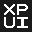

<picture>
  <source media="(prefers-color-scheme: dark)" srcset="assets/mark-inverted.svg">
  
</picture>

# XPUI brand

The XPUI mark and every file made from it. Other repositories copy what they need from
`assets/`; nothing there is edited by hand.

| | |
|---|---|
| [docs/manual.md](docs/manual.md) | which file for which job, the rules, and the README and web snippets |
| [assets/](assets/) | the files to copy |
| [candidates/](candidates/README.md) | the four drawings the mark was chosen from, and why this one |
| [tools/](tools/) | the pixel alphabet, the drawing, and what derives everything from it |

## Rebuilding

```bash
./build-and-test.sh
```

It regenerates `assets/` and the manual's screenshots, then proves them: two tones on the
grid, integer coordinates, each inverted file the same geometry as its master, every raster
ink and paper at its size, and every path the documentation names. Read the exit code.

It needs `python3`, `rsvg-convert` and `magick`. The screenshots need a Chromium; without one
they are skipped with a note, and `CHROME` points at one.

## Licence

The mark, `assets/` and `docs/images/` are [CC BY 4.0](LICENSE-ARTWORK), with the manual's
rules on use. The scripts are [MIT](LICENSE).
