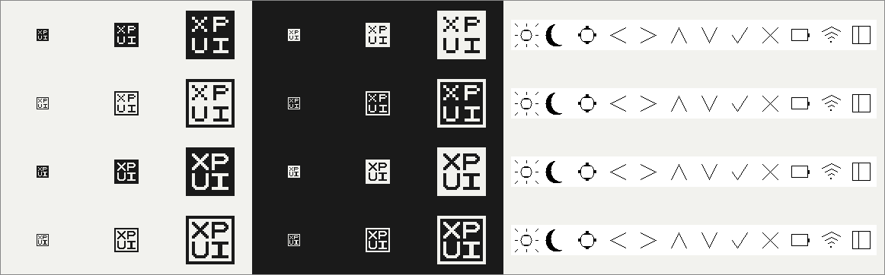

# Candidates

The four drawings the mark was chosen from, on 2026-09-11. Each is "XP" over "UI" in a square,
in the same pixel alphabet at two weights.

| File | Drawing |
|---|---|
| [a-solid.svg](a-solid.svg) | ink square, letters cut out; 16 grid, 1 px strokes |
| [a-outline.svg](a-outline.svg) | ink frame, ink letters; 16 grid, 1 px strokes |
| [b-solid.svg](b-solid.svg) | ink square, letters cut out; 32 grid, 2 px strokes |
| [b-outline.svg](b-outline.svg) | ink frame, ink letters; 32 grid, 2 px strokes |

## The choice

**`b-solid` at 32 px and up, `a-solid` at 16 px** — one mark in two weights.

- `b-solid` reads best from 32 px: the bold strokes hold the letters apart and the square
  stays solid.
- At 16 px `b-solid` has no pixels of its own; `a-solid` is drawn exactly there, which is
  what a favicon and a small avatar need.
- The outlines crowd a 1 px frame against 1 px letters at 16 px.
- Flat and square, with no perspective: a tilted cube smudges at favicon size, and a tilted
  black cube with two lines of letters is someone else's mark.
