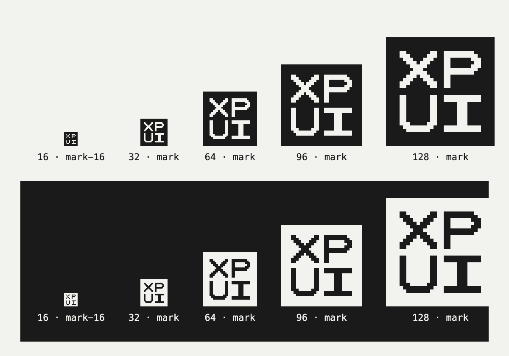
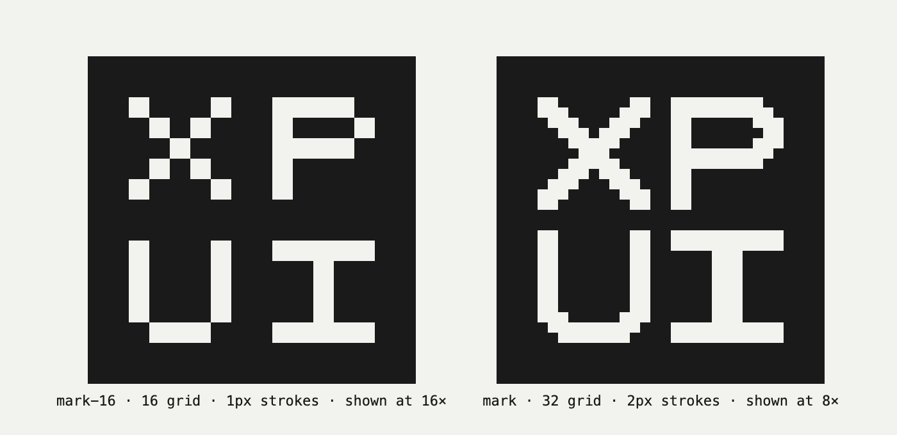
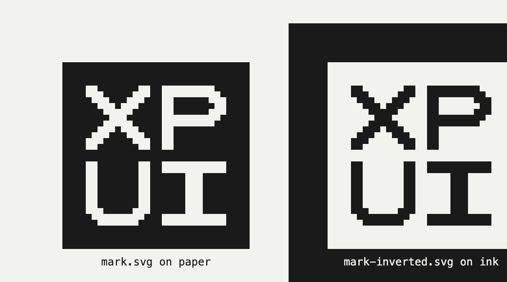
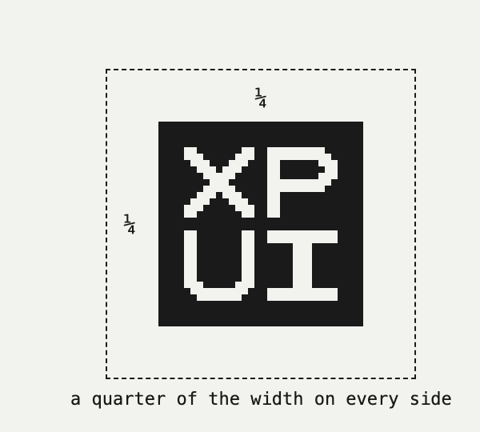
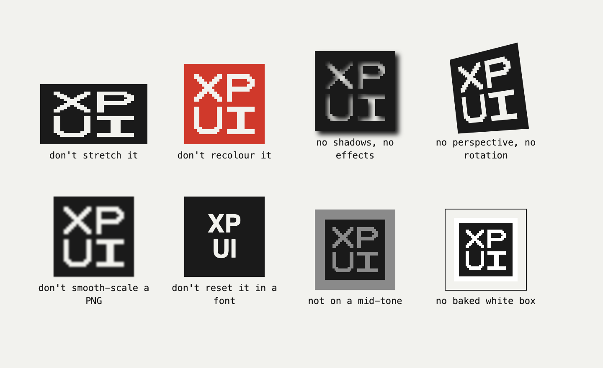
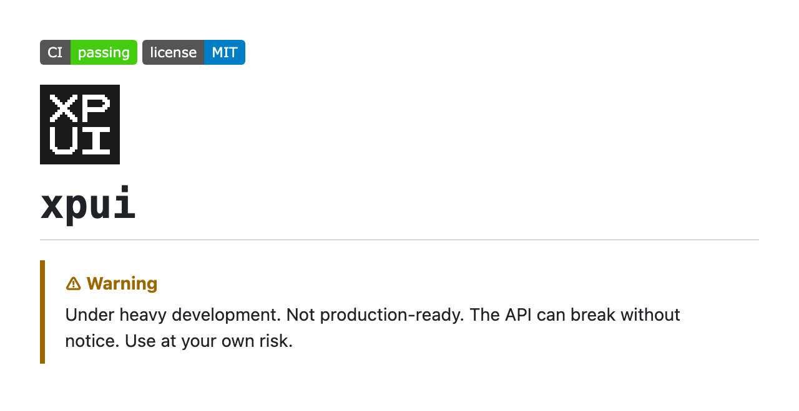
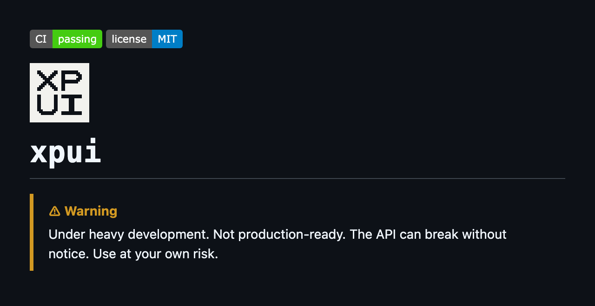
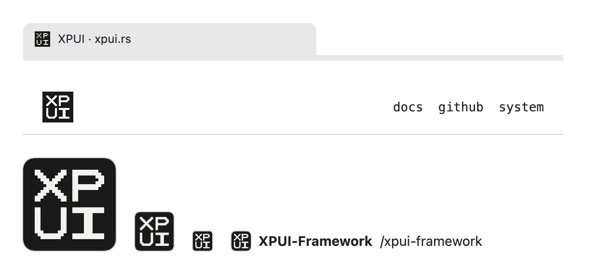
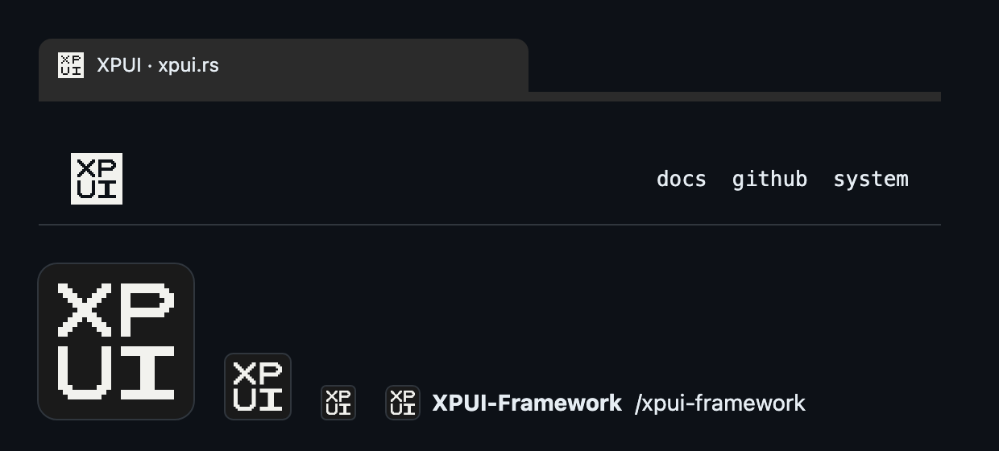

# Using the XPUI mark

"XP" over "UI" in a square, drawn on a pixel grid in two tones. This is which file to use
where, the few rules that keep it recognisable, and the snippets for a README and a web page.



## What it is

The mark obeys the rule the framework draws everything under: two tones and only two, ink on
paper, grey only ever as a dither. `Palette` in `xpui-embedded-graphics` has exactly two
fields, `ink` and `background`; the mark holds nothing a 1-bit panel could not show.
Monochrome by design, not by limitation.

Its letters are holes, not paint. On paper the square is ink and the letters are the paper
showing through; on a dark ground the inverted file turns the square to paper and the letters
take the ground — the way an e-paper panel inverts.

## Two drawings

| File | Grid | Strokes | Used at |
|---|---|---|---|
| `mark.svg` | 32 × 32 | 2 px | 32 px and larger |
| `mark-16.svg` | 16 × 16 | 1 px | exactly 16 px |



At 16 px the 32-grid drawing has no pixels of its own: every stroke halves, and what reaches
the screen is the renderer's guess. The 16-grid drawing is exact there, so the favicon and
the smallest avatars use it, and everything else uses `mark.svg`.

Whole multiples of the grid put every edge on a device pixel: 32, 64, 96, 128, 256 and 512
for `mark.svg`; 16 and 48 for `mark-16.svg`. Between those, the files' `shape-rendering="crispEdges"`
keeps the edges sharp, but a stroke can come out a pixel wider on one side.

## Colours

| | |
|---|---|
| Ink | `#1A1A1A` |
| Paper | `#F2F2EE` |

Nothing else — no third colour, no gradient, no opacity. `mark.svg` is ink and
`mark-inverted.svg` is paper: use whichever contrasts with the ground.



## Space and size

Keep a quarter of the mark's width clear on every side: 32 px around a 128 px mark. Nothing
smaller than 16 px.



## What not to do



- **Don't stretch it.** Scale both sides together.
- **Don't recolour it.** Ink or paper, nothing between and nothing else.
- **No shadows, glows, outlines or effects.**
- **No rotation and no perspective.** The mark is flat and square.
- **Don't smooth-scale a PNG.** Use the SVG, or a PNG at its own size, or scale with
  `image-rendering: pixelated`.
- **Don't reset "XP UI" in a font.** The letters are drawn, not typed.
- **Not on a mid-tone or a busy image.** The letters are holes and take whatever is behind them.
- **No baked white box.** The masters are transparent so each ground supplies its own paper.

## Which file

All of them are in [`assets/`](../assets/).

| File | For |
|---|---|
| `mark.svg` | light grounds, 32 px and up |
| `mark-inverted.svg` | dark grounds, 32 px and up |
| `mark-16.svg`, `mark-16-inverted.svg` | the same, at exactly 16 px |
| `favicon.svg` | a browser tab; carries its own paper ground and swaps ink and paper when the operating system is dark |
| `favicon.ico` | browsers without SVG icons: 16 and 48 from `mark-16`, 32 from `mark` |
| `apple-touch-icon.png` | a phone's home screen, 180 × 180 |
| `mark-512.png` | the organisation and repository avatar |
| `mark-16.png`, `mark-32.png` | anywhere an SVG is not accepted |
| `social-1280x640.png` | a repository's social preview |

Every PNG and the ICO are opaque, ink on paper: a transparent letter on a dark page or a dark
tab would vanish.

## In a README

`<picture>` lets GitHub choose the file by the reader's theme:

```html
<picture>
  <source media="(prefers-color-scheme: dark)" srcset="assets/mark-inverted.svg">
  
</picture>
```

 

- **Copy `mark.svg` and `mark-inverted.svg` into that repository's `assets/`.** An image in a
  README is read from the repository the README is in; a URL into this one fails for every
  reader while it is private.
- **Put it on the line after the badge line**, then a blank line, then the `#` title. The
  blank line ends the HTML block, so the title still renders as a heading.
- **Width 64**, twice the grid.
- A renderer that ignores `<picture>` shows the ``, the light-theme mark.
- **Nothing checks these paths.** `documented paths resolve` reads markdown links, `[text](path)`,
  and not `src=` or `srcset=`, so a moved or deleted `assets/` file breaks the logo silently.
  Open the README on GitHub in both themes after changing it.

## On a web page

```html
<link rel="icon" href="/favicon.ico" sizes="32x32">
<link rel="icon" href="/favicon.svg" type="image/svg+xml">
<link rel="apple-touch-icon" href="/apple-touch-icon.png">
```

A browser that reads SVG icons takes `favicon.svg`, and the rest take the ICO. A tab icon
follows the operating system's theme, never a site's own toggle: no page can reach into its tab.

Inside the page, inline `mark.svg` and set its `fill` to `currentColor`. The square takes the
text colour and the letters, being holes, show the ground, so the mark inverts with whatever
theme the page is in.

 

## On GitHub

The avatar and the social preview are set in the web interface; `gh` sets neither.

- **The organisation avatar:** `github.com/organizations/XPUI-Framework/settings/profile`,
  upload `mark-512.png`. GitHub does not accept an SVG there.
- **A repository's social preview:** Settings → Social preview, upload `social-1280x640.png`.
  Services crop it differently, which is why the mark sits well inside the middle.

## Licence and use

The mark and every image made from it are [CC BY 4.0](../LICENSE-ARTWORK). Credit it as
"XPUI mark by Thiago Holanda, CC BY 4.0".

The licence governs copying. The mark also identifies the project, and for that the project asks:

- **Use it, unmodified, to refer to XPUI** — an article, a talk, a "built with XPUI" line, a
  list of frameworks.
- **Don't use it as the logo of another project, product or fork.** A fork takes its own name
  and its own mark.
- **Don't use it to suggest the project endorses something it does not.**

Questions go to <contact@xpui.rs>.
